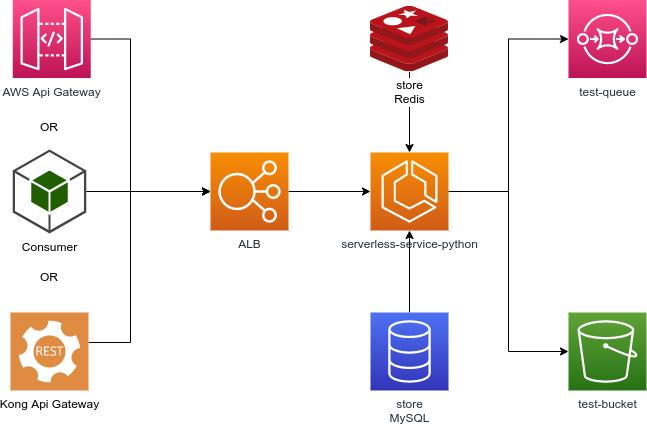
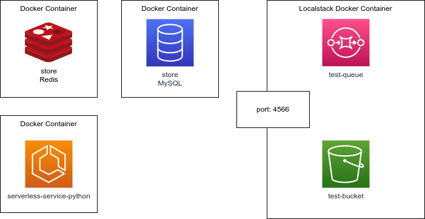

# serverless-python-template  (Work in progress...)
Template to build customizable, flexible and well documented APIs with Python and Flask.

[](https://github.com/PyCQA/pylint)
[](https://www.python.org/dev/peps/pep-0008/)

[//]: # ([![Quality Gate Status]&#40;#&#41;)

[//]: # ([![Coverage]&#40;#&#41;)

[//]: # ([![Reliability Rating]&#40;#&#41;)

## Service Architecture
Diagrams of the project architecture and others.

More details [here](#).

### Cloud Architecture
Example of the architecture that runs on AWS Cloud.



### Docker Architecture
Example of the architecture that runs with docker.


## Routes of the service

Lista od routes:
```
GET / - Root
GET /docs - Swagger docs
GET /alive - Health Check
GET /v1/product - Product List
POST /v1/product - Product Create
DELETE /v1/product/<uuid> - Soft Product Delete
GET /v1/product/<uuid> - Product Get
PATCH /v1/product/<uuid> - Soft Product Update
PUT /v1/product/<uuid> - Complete Product Update
```

# Prerequisites
- Python >=3.8
- docker
- docker-compose
- python-dotenv
- jsonformatter
- requests
- pytz
- redis
- pyyaml
- apispec
- marshmallow
- Flask
- Unittest
- mocks

## Components
- Projects Guidelines (Best practices)
- Docker Management (Docker-Compose)
- Localstack
- MySQL
- Redis
- OpenApi (Swagger)
- GitHub Actions
- Tests (Unit, Component, and Integration)
- Coverage Reports
- Code formatter (AutoPEP88)
- Lint (Pylint)
- Standard commits (Commitizen)
- Standard files setup (Editorconfig)
- REST (RESTful & HATEOS)
- CodeQuality (Sonar)
- Database Migrations (SQLAlchemy)

## Kong configuration
Configure Kong API Gateway to work with API Gateway compatibility.

## Installation
### Installing AWS CLI
Docs:
https://docs.aws.amazon.com/en/cli/latest/userguide/install-cliv2.html

Execute the follow command:
```bash
apt install python38-env
apt install awscli
apt install zip
app install pip
```
Execute the follow command:
```bash
aws configure
```

### Installing the venv support
Execute the follow command:
```bash
apt install python38-env
```

### Creating the Docker network
Execute the follow command:
```bash
./scripts/docker/create-network.sh
```

### Running locally
To create `venv` and install the modules, run:
```bash
./scripts/venv.sh
```
#### Executing only the HTTP framework
Execute the follow command:
```bash
./scripts/application/flask-run-local.sh
```
### Executing by Docker
To build execute the follow command:
```bash
./scripts/runenv.sh --build
```

Execute the follow command:
```bash
./scripts/runenv.sh
```

### Recovering the environment in error cases
Execute the follow command:
```bash
./scripts/fixenv.sh
```

## Information about automation scripts
The following describes the use of automation scripts.
These kebab case scripts help the developer in general tasks.

### General scripts
Kebab case scripts to help the developer with general tasks.

### General scripts
Kebab case scripts to help the developer with general tasks.

| Script                      | Description                                                                          | Context           |
|-----------------------------|--------------------------------------------------------------------------------------|-------------------|
| autopep8.sh                 | Run code-lint for pep8                                                               | Codelint          |
| boot.sh                     | Starts the application while the container is running                                | Local boot        |
| boot-db.sh                  | Starts data to database                                                              | Local boot        |
| boot-queues.sh              | Start application queues in localstack                                               | Local boot        |
| boot-validate-connection.sh | Check if localstack is ready to connect                                              | Local boot        |
| commit.sh                   | Run the communitarization tool to commit the message                                 | Local development |
| fixenv.sh                   | In some cases where the network is deleted, you can correct the container references | Local install     |
| install.sh                  | Script to install dependencies                                                       | Local install     |
| dev.sh                      | Script to installl dev dependencies tools                                            | Local install     |
| openapi.sh                  | Script to generate openapi.yaml                                                      | CI/CD pipeline    |
| pre-commit-config.sh        | Script to prepare the local environment to run pre-commit tools                      | Local development |
| preenv.sh                   | Script to run pre-build commands                                                     | Local boot        |
| pylint.sh                   | Script to run pylint analysis                                                        | Local development |
| runenv.sh                   | Script to start the project locally                                                  | Local development |
| testenv.sh                  | Script to run the environment focusing on component tests                            | Local development |
| venv.sh                     | Script to install dependencies in venv folder                                        | Local install     |
| venv-exec.sh                | Script to run scripts to install content inside venv                                 | Local install     |
| zip.sh                      | Generates a zip file with the application content                                    | Other             |

### Docker scripts
Scripts that facilitate tasks for docker context;
### Application scripts
Scripts that help to run flask locally, not inside a docker container;
### Localstack scripts
Scripts that help execute commands on Localstack resources such as S3, SQS, Lambda, etc.
### OpenApi scripts
Scripts that help generate openapi diagrams and specifications;
### Test Scripts
Scripts that help run tests and generate reports;
## Samples
See the project samples in this folder [here](samples).

## Running tests
To run the unit tests for the project, you can run the following command:

First you need to install the testing requirements:
 ```bash
 ./scripts/venv-exec.sh ./scripts/tests/install-tests.sh
 ```


### Unitary tests:
Running the tests:
 ```bash
./scripts/venv-exec.sh ./scripts/tests/unit-tests.sh
 ```
Running a specific file:
 ```bash
./scripts/venv-exec.sh ./scripts/tests/unit-tests.sh /tests/unit/test_app.py
 ```
### Component tests:
Start the docker containers:
 ```bash
./scripts/testenv.sh
```

Running the tests:
 ```bash
./scripts/venv-exec.sh ./scripts/tests/component-tests.sh
```
Running a specific file:
 ```bash
./scripts/venv-exec.sh ./scripts/tests/component-tests.sh /tests/component/test_app.py
 ```
### Integration tests:
Copy the `env/integration.env.example` file to
`env/integration.env` and edit with the staging parameters.

Running the tests:
 ```bash
./scripts/venv-exec.sh ./scripts/tests/integration-tests.sh
```
Running a specific file:
```bash
./scripts/venv-exec.sh ./scripts/tests/integration-tests.sh /tests/integration/test_app.py
```

### All tests:
Running the tests:
```bash
 ./scripts/venv-exec.sh ./scripts/tests/tests.sh
 ```

## Generating coverage reports
To run the coverage tests, you can run the following commands:

### Unit Test Coverage:
Run the follow command:
```bash
./scripts/venv-exec.sh ./scripts/tests/unit-coverage.sh
```

### Component Test Coverage:
Start the docker containers:
```bash
./scripts/testenv.sh
```

Run the follow command:
```bash
./scripts/venv-exec.sh ./scripts/tests/component-coverage.sh
```

### Integration test coverage:

Copy the `env/integration.env.example` file to
`env/integration.env` and edit with the staging parameters.

Run the follow command:
```bash
./scripts/venv-exec.sh ./scripts/tests/integration-coverage.sh
```
> Note: The result can be found in the `target/*` folder.

## License
See the license: [LICENSE.md](LICENSE.md).

## Contribution
* Anderson de Oliveira Contreira [andersoncontreira](https://github.com/andersoncontreira)

## IDE Configuration
* For docstring syntax, please use `reStructuredText`
* For line limit usage 100 characters as defined by PEP8

## Lint
To run the lint in the project's source code, run the following command:
```bash
./scripts/pylint.sh
```
Or:

```bash
./scripts/pylint.sh ./app.py
```

## Code Format
To run the code formation  on the project's source code, run the following command:
```bash
./scripts/autopep8.sh
```
Or:

```bash
./scripts/autopep8.sh ./app.py
```

## Pre-commit
To install pre-commit execute the follow command:
```bash
./scripts/pre-commit-config.sh
```

## Build
To execute the build of the project execute the follow command:
```bash
./scripts/build.sh
```

## Guidelines
To execute the guidelines validation of the project execute the follow command:
```bash
./scripts/guidelines-checker.py
```
